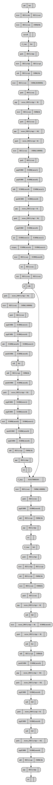
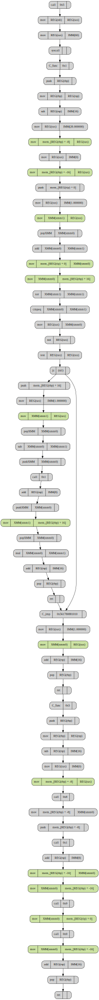
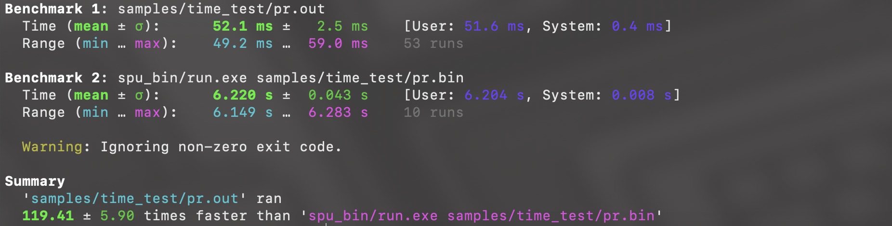

# Компилятор для языка программирования KVM

## Описание

**KVM** - C-подобный язык программирования высокого уровня. Он позволяет делать простейшие математические вычисления, получать данные на вход и отправлять их на выход. В языке присутствуют циклы и условные операторы. Компилятор способен создать несколько выходных форматов: ассемблер [собственной виртуальной машины](https://github.com/artemneskorodov/spu), ассемблер, для компиляции с помощью **NASM** для **X86-64**, а также бинарный файл в формате **ELF**, который может быть запущен сразу после компиляции.

## Устройство компилятора

Компиляция состоит из трёх этапов: Front-end, Middle-end и Back-end. Ниже приведено их описание. В компиляторе также присутствует реверсивный Front-end, который позволяет генерировать исходный код из промежуточного этапа представления программы: AST (Абстрактное синтаксическое дерево). Схема компилятора, составленная из нескольких этапов, представленных как независимые друг от друга модули позволяет для каждого языка писать лишь один Front-end, и для каждого процессора лишь один Back-end.

<div align="center">
    
    <p><i><b>Рисунок 1</b> Схема архитектуры компилятора </i></p>
</div>

### Front-end

Во Front-end'е происходит преобразование исходного кода на языке KVM в абстрактное синтаксическое дерево (далее AST).
Первым этапом Front-end'а является лексический анализ. Программа разбивает текст на лексемы, которыми являются числа, математические операторы, ключевые слова, скобки, границы области видимости, а также все слова, использованные программистом.
Вторым этапом является синтаксический анализ. Программа использует массив лексем, созданный лексическим анализатором, для создания AST. В ходе синтаксического анализа также определяются ссылки, то есть обращения к переменным и функциям становятся обращением не просто к элементу с некоторым именем, а к конкретному элементу в таблице имён. Создание связей в процессе синтаксического анализа позволяет использовать сразу несколько переменных, названных одинакого, но находящихся в разной области видимости. Использование стека в процессе определения связей позволяет сделать доступ к более локальным переменным более приоритетным.
Синтаксическое дерево записывается в файл, в формате, совместимом с другим компилятором ([Репозиторий этого компилятора](https://github.com/sevaphasol/compiler)). Плюсы этого подхода описаны выше: общее представление дерева позволяет писать лишь один Back-end для каждого процессора и лишь один Front-end для каждого языка.

[Определения формата дерева](#логический-формат-ast) и [формата записи в файл](#формат-хранения-ast-в-файле).

### Middle-end

Middle-end производит оптимизации над AST. В этом компиляторе представлены только свёртка констант и удаление нейтральных операций, однако есть возможность добавить большее количество оптимизаций.

### Back-end

В Back-end'е происходит преобразование дерева в финальный файл, который представляет из себя либо ассемблерный код для виртуальной машины(далее **SPU**), либо ассемблерный код для **NASM**, либо исполняемый бинарный файл в формате **ELF**.

#### Компиляция для **SPU**

Для компиляции под **SPU** программа пробегает по дереву и сразу генерирует ассемблерный код.

#### Компиляция для **X86**

Для создания ассемблерного кода для **NASM** и генерации исполняемого файла сначала происходит создание низкоуровневого промежуточного представления (далее **IR**). Его описание можно найти в [этом разделе](#представление-в-виде-ir). Генерация **IR** похожа на компиляцию для виртуальной машины. Выполняется такой же проход по дереву.

После генерации **IR** происходит преобразование в ассемблерный код или в исполняемый файл. Оно выполняется с помощью эмитторов инструкций.

Промежуточное представление **IR** позволяет делать множество операций для оптимизации. В данном проекте реализована только проверка на соответствующие push'ы и pop'ы, которые заменяются на один mov.

### Front-start (реверсивный Front-end)

Это дополнение языка, которое позволяет восстановить исходный код по **AST**. Оно не представляет из себя ничего серьёзного, но помогает проверить возможность кросскомпиляции.

### Пример полного преобразования программы в процессе компиляции

Для примера преобразуем простейший код, написанный на языке **KVM**, выполняющий вычисление факториала. Для примера в функции вычисления факториала созданы две неиспользуемые переменные, про них мы поговорим позже, в момент обсуждения оптимизации.

```C
var counter = 0;

func factorial(var nomer) {
        var unused = 1 + 2 + 3 + 4 + 5 + 6 + 7;
        var unused_ = (unused + 1 + unused * 7) * 0;

        counter = counter + 1;
        if(nomer) {
                return factorial(nomer - 1) * nomer;
        }
        return 1;
}

func main() {
        var nomer = 0;
        input(nomer);
        var fact = factorial(nomer);
        output(fact);
        output(counter);
        return fact;
}
```

Абстрактное синтаксическое дерево, полученное после работы Front-end'а представлено на рисунке ниже. Как видно, вычисления, связанные с инициализацией переменных unused и unused_ остались в дереве.

<div align="center">
    
    <p><i><b>Рисунок 2</b> Результат работы Front-end'а </i></p>
</div>

Далее в Middle-end'е производится свёртка констант, а также упрощение действий с нейтральными элементами. Графическое представление работы Middle-end'а представлено на рисунке ниже. Как видно, тело функции, находящейся в дереве левее (идентификатор функции - узел бордового цвета) стало гораздо меньше.

<div align="center">
    
    <p><i><b>Рисунок 3</b> Результат работы Middle-end'а </i></p>
</div>

В Back-end'е первым делом создаётся промежуточное представление, ниже представлен его графический дамп.

<details>
    <summary>Графический дамп IR </summary>

<div align="center">
    
    <p><i><b>Рисунок 4</b> Графический дамп IR сразу после создания </i></p>
</div>
</details>


Далее в Back-end'е происходят оптимизации над **IR**, ниже представлен графический дамп оптимизированного **IR**, зелёным цветом выделены оптимизированные узлы.

<details>
    <summary>Графический дамп оптимизированного IR </summary>

<div align="center">
    
    <p><i><b>Рисунок 5</b> Графический дамп оптимизированного IR </i></p>
</div>
</details>


## Компиляция программы

Создание AST:
```sh
bin/frontend -i name.kvm -o name.tree
```

Оптимизация дерева:
```sh
bin/middleend -i name.tree -o name_opt.tree
```

Компиляция исполняемого файла:
```sh
bin/backend -i name.tree -o name.out -m MACHINE
```

На место *MACHINE* можно вписать одно из следующих значений:
- **spu** для создания кода для виртуальной машины
- **asm** для генерации ассемблерного кода для **NASM**
- **elf** для создания исполняемого файла в формате **ELF**

Запуск реверсивного Front-end'а:
```sh
bin/frontstart -i name.tree -o name.kvm
```

## Стандартная библиотека

В языке также присутствует стандартная библиотека: **stdkvm.lib**, она позволяет не переполнять файл одинаковыми инструкциями для операций языка **input** и **output**. Библиотека написана на языке ассемблера и скомпилирована с помощью **NASM**. В начале файла библиотеки находятся адреса стандартных функций, которые читаются Back-end'ом в момент вставки библиотеки в исполняемый файл.

## Представление в виде **AST**

### Логический формат **AST**

На рисунках ниже схематично представлены возможные узлы абстрактного синтаксического дерева.

- - -

<div align="center">
    
    <p><i><b>Рисунок 6</b> Математическая операция с 2 параметрами </i></p>
</div>

- - -

<div align="center">
    
    <p><i><b>Рисунок 7</b> Математическая операция с 1 параметром </i></p>
</div>

- - -

<div align="center">
    
    <p><i><b>Рисунок 8</b> Создание новой переменной </i></p>
</div>

- - -

<div align="center">
    
    <p><i><b>Рисунок 9</b> Условный оператор </i></p>
</div>

- - -

<div align="center">
    
    <p><i><b>Рисунок 10</b> Цикл </i></p>
</div>

- - -

<div align="center">
    
    <p><i><b>Рисунок 11</b> Оператор ввода </i></p>
</div>

- - -

<div align="center">
    
    <p><i><b>Рисунок 12</b> Оператор вывода </i></p>
</div>

- - -

<div align="center">
    
    <p><i><b>Рисунок 13</b> Возврат из функции </i></p>
</div>

- - -

<div align="center">
    
    <p><i><b>Рисунок 14</b> Тело (условного оператора, цикла или функции) </i></p>
</div>

- - -

<div align="center">
    
    <p><i><b>Рисунок 15</b> Функция </i></p>
</div>

- - -

### Формат хранения **AST** в файле

В файле вместе с деревом записана таблица имён. Формат таблицы имён описан ниже:
```
[size]
{[name_len] [name] [type] [is_global] [params]}
...
```
- \[size\] - Количество элементов.
- \[name_len\] - Количество символов в имени (используется для отсутствия необходимости считать длину много раз).
- \[name\] - Буквенное имя идентификатора.
- \[type\] - Тип идентификатора (1 для переменной и 2 для функции).
- \[is_global\] - поле, установленное в 1 только если идентификатор является глобальной переменной. Во всех остальных случаях 0.
- \[params\] - количество параметров. Поле используется только для функций, для переменных оно должно быть установлено в 0.

Далее в файле записано само дерево. Его формат:
```
[size]
{[type] [value] [left] [right]}
```
- \[size\] - Количество узлов в дереве.
- \[type\] - Тип узла (1 для узла с операцией, 2 для узла с непосредственным значение, 3 для узла с идентификатором)
- \[value\] - Значение узла (опкод для операции, число с плавающей точкой для узла с непосредственным значением и индекс в таблице имён для идентификатора)
- \[left\] и \[right\] - поддеревья в таком же формате (если поддерево отсутствует, то на его место ставится '_')

## Представление в виде **IR**

В этом компиляторе нет возможности хранения **IR** в файле. Он создаётся и хранится только в момент работы Back-end'а. Однако остаётся возможность добавить её. Пока это не сделано для сохранения стандартного общего представления, необходимого в Middle-end для оптимизации.

**IR** представляет из себя двусвязный список, каждым элементом которого является инструкция, выполняющая операции с регистрами общего назначения, XMM-регистрами, адресами памяти или непосредственными значениями. Для удобства соответствующие инструкции для разных типов аргументов были объеденены в одну в этом представлении (например перемещение между регистрами общего назначения и перемещение из XMM-регистра в память для разработчика языка выглядят одинакого).

## Создание **ELF** файла

В данном проекте исполняемые программы создаются со структурой минимального **ELF**-файла. Она приведена на картинке ниже.

<div align="center">
    
    <p><i><b>Рисунок 16</b> Функция </i></p>
</div>

Сначала идёт заголовок **ELF**-файла. Затем два заголовка для сегментов: один для сегмента кода и один для сегмента данных. Затем идёт сегмент кода в котором находятся скомпилированные функции и приписанная к ним стандартная библиотека. После них с выравниванием в 1600 байт начинается сегмент данных, в котором хранятся глобальные переменные.

## Сравнение реального процессора и виртуального

Как уже было сказано, компилятор способен генерировать исполняемый **ELF**-файл, ассемблерный код для **NASM** и ассемблерный код для **SPU** (виртуальной машины).

Для сравнения времени используется программа **hyperfine**. Она позволяет запустить тесты сразу для двух исполняемых файлов и сравнивает время их работы.

В качестве примера для теста была выбрана программа, рекурсивно вычисляющая 10-е число Фибоначчи. Код программы на языке **KVM** представлен ниже.

```C
func fibonachi(var num) {
    if(num > 2) {
        var fib_n = fibonachi(num - 1);
        var fib_nn = fibonachi(num - 2);
        return fib_n + fib_nn;
    }
    return 1;
}

func main() {
    var num = 10;
    var iters = 100000;
    var result = 0;
    while(iters) {
        result = fibonachi(num);
        iters = iters - 1;
    }
    output(result);
    return 0;
}
```

Программа 100000 раз вычисляет 10-е число Фибоначчи. Она запускается на виртуальной машине и на реальном процессоре. Вывод **hyperfine**:

<div align="center">
    
    <p><i><b>Рисунок 17</b> Результат сравнения времени работы программы на SPU и на процессоре X86 </i></p>
</div>

Как видно, программу удалось ускорить примерно в 120 раз. Это показывает, насколько реальный процессор быстрее виртуального.
